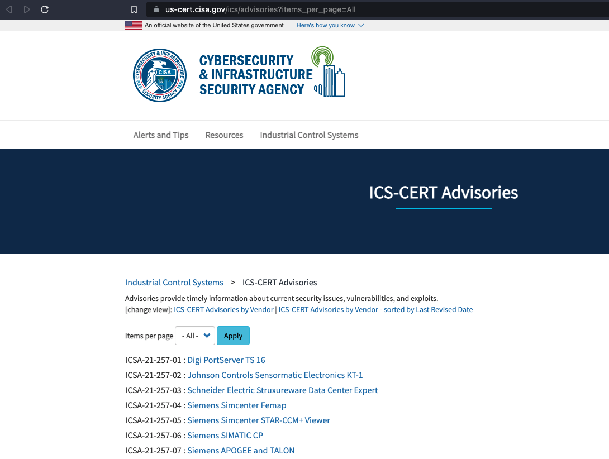
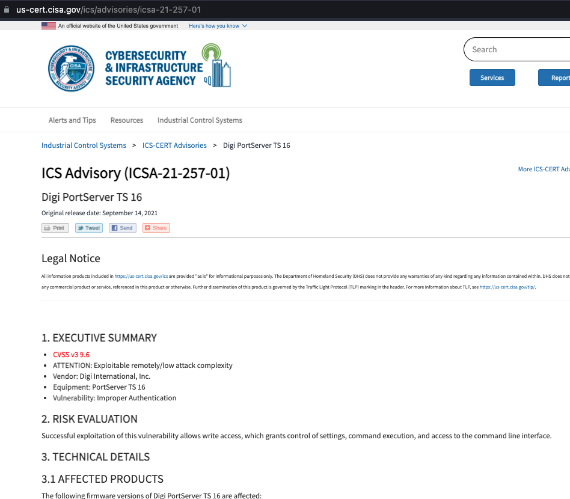
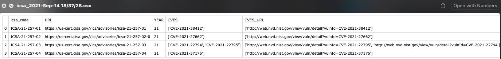

# CISA-ICS-CERT-Advisories-scrapping
This is a very simple script that scrapes the ICSA Advisories from [us-cert.cisa.gov](https://us-cert.cisa.gov/ics/advisories?items_per_page=All) and returns it in a csv files.

For every advisory ICSA that is in [this list](https://us-cert.cisa.gov/ics/advisories?items_per_page=All)

We gather information from every ICSA advisory and format it nicely in a csv file

CSV Example

